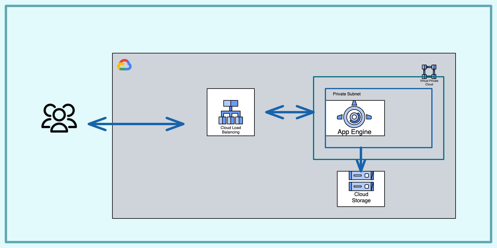

# hello-world-app-engine

In this solution we deploy a nodejs "Hello World" app on App Engine Flexible service. The service is deployed within a private subnet with an internal IP, and it is accessible through an external https load balancer.

## Solution Design

The infrastructure is composed by the following resources:

- An App Engine Flexible service deployed in "europe-west2" region within a private subnet. Flexible environment gives you the possibility to define the network where you want to deploy your service and whether you want to give it a public or private IP address.  
- An external https load balancer that has the App Engine service configured as its serverless NEG backend




## Pre-requisites

Run the [setup.sh](setup.sh) script to install all the required APIs

```bash
chmod +x setup.sh
./setup.sh
```

## Deploying the infrastructure with Terraform

cd into the Infrastructure folder and run the following commands

```bash
terraform init
terraform plan 
terraform apply
```

## Delete resources and clean project

In your Infrastructure folder run.  

```bash
terraform destroy
```

Please, be aware that, once created, **you cannot delete your App Engine instance** and you cannot destroy your "default" flexible environment. In order to avoid costs, go in your App Engine Console and **STOP the default service**. 
